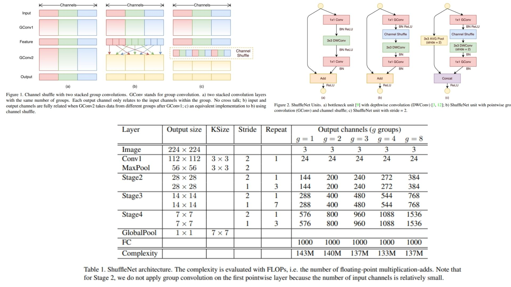

# 🃏 ShuffleNet-Replication PyTorch Implementation

This repository contains a replication of **ShuffleNet**, based on the paper **“ShuffleNet: An Extremely Efficient Convolutional Neural Network for Mobile Devices”**, using PyTorch. The model is designed for **lightweight and efficient image classification**, using **pointwise group convolutions** and **channel shuffle operations**.

- Implemented **ShuffleNet** using **modular ShuffleNet units** with **pointwise group convolution** and **channel shuffle** to maintain efficiency while preserving accuracy.

- Architecture:  
**Stem → Stage2 → Stage3 → Stage4 → GlobalAvgPool → Flatten → FC**

> **Note on channel shuffling:** Channel shuffle ensures cross-group information flow. Our implementation strictly follows the paper, maintaining **group convolution → channel shuffle → depthwise conv** sequence for each unit.

**Paper reference:** [ShuffleNet: An Extremely Efficient Convolutional Neural Network for Mobile Devices](https://arxiv.org/abs/1707.01083) 🌀


---

## 🖼 Overview – ShuffleNet Architecture

  

**Figure 1:** Illustration of group convolution + channel shuffle concept (cross‑group information flow).  
**Figure 2:** Structure of a ShuffleNet unit (pointwise group conv → channel shuffle → depthwise conv) and downsampling (stride = 2) variant.  

## 📋 Model Parameters – Table 1  

Refer to **Table 1** in `images/figmix.jpg` for detailed layer/ stage configuration: channel counts, group settings (g), repeats per stage, output sizes.  

> **Model overview:**  
> ShuffleNet achieves high efficiency by combining **pointwise group convolution** and **channel shuffle**, allowing information mixing across groups while keeping computation low. Depthwise convolutions reduce FLOPs, and repeated units maintain representational power without increasing model size significantly.

---

## 🏗 Project Structure

```bash
ShuffleNet/
│
├── src/
│   ├── layers/
│   │   ├── conv1_layer.py            # Initial 3x3 conv layer
│   │   ├── flatten_layer.py          # Flatten layer
│   │   ├── fc_layer.py               # Fully connected layer
│   │   ├── pool_layers/
│   │   │   ├── maxpool_layer.py      # MaxPool
│   │   │   └── avgpool_layer.py      # AdaptiveAvgPool
│   │   ├── channel_shuffle.py        # Channel shuffle operation
│   │
│   ├── blocks/
│   │   └── shufflenet_unit.py        # ShuffleNet unit combining group conv, shuffle, depthwise conv
│   │
│   ├── model/
│   │   └── shufflenet.py             # Full ShuffleNet model combining Stem + Stages
│   │
│   └── config.py                      # Input size, num_classes, groups, stage channels
│
├── images/
│   └── figmix.jpg                     # Figures and table 1
│
├── requirements.txt
└── README.md
```
---

## 🔗 Feedback

For questions or feedback, contact: [barkin.adiguzel@gmail.com](mailto:barkin.adiguzel@gmail.com)
